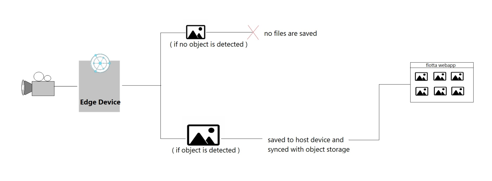

# Image Classification tool for Edge Devices
| Note: Follow the [documentation](https://project-flotta.io/documentation/v0_2_0/intro/overview.html) to get started with [Flotta](https://project-flotta.io/).

- [Motivation](#need)
- [Resources](#model-used)
- [How to use](#run)
- [Getting Started](#getting-started)
## Need
Objection detection is of vital importance to many fields, such as autonomous driving, outdoor robotics, and computer vision. Many approaches of object detection can hardly run on the resource-constrained edge devices with the approach of applying real-time object detection on edge devices with low inference time and high accuracy. 

**Why for Edge Devices?** -
The need for on-device data analysis arises in cases where decisions based on data processing have to be made immediately. With the arrival of powerful, low-energy consumption Internet of Things devices, computations can now be executed on edge devices such as robots. This has given rise to the era of deploying advanced machine learning methods at the edges of the network for “edge-based” Machine Learning.

### Model Used 
State-of-the-art lightweight YOLOv4-tiny model(<50MB) is especially useful if you have limited compute resources in either research or deployment, and are willing to tradeoff some detection performance for speed.

Key aspects:

 - The FPS (Frames Per Second) in YOLOv4-tiny is approximately eight times that of YOLOv4. However, the accuracy for YOLOv4-tiny is 2/3rds that of YOLOv4 when tested on the MS COCO dataset.
 - In contrast to YOLOv4, which has three YOLO heads, this model only has two, and it was trained using 29 pre-trained convolutional layers.
 - Since faster inference time is more crucial than precision or accuracy while working in a real-time object detection environment, YOLOv4-tiny is a superior option than YOLOv4 for real-time object detection.
  > Reference [here](https://arxiv.org/abs/2011.04244) and [here](https://arxiv.org/abs/2011.08036)

Workload Requirements 
  - Python >=3.7
  - OpenCV 4.6
  
>Docker and Kubernetes required.

## Run
***Note: For detailed description visit [Flotta](https://project-flotta.io/documentation/latest/intro/overview.html)***

Working of the project -


**Before Getting Started let's understand few things -**

If you have followed the documentation, in Flotta we create the user flotta as part of the flotta rpm installation and run the workloads with that user.

Make sure on the device that flotta user group has access to the camera/webcam -
```shell
[root@device ~]# id flotta
uid=1001(flotta) gid=1001(flotta) groups=1001(flotta),39(video)
```
if you can't see the video group, run the following command and check again.
```shell
[root@device ~]# usermod -a -G video flotta
```
And now the flotta user has access to the video group.

You will need a webcam mounted to your workload or else it fails with no device connected. Change the device id from 0 to 1/2/3... specific to your device in `edgeworkload.yaml`.
```yaml
volumemounts:
 - mountPath: /dev/video0
   name: video
```
(and here)
```yaml
volumes:
- name: video 
  hostPath:
    path: /dev/video0
    type: File
```

**Configurable parameters**
- `threshold = 0.25`        *confidence threshold suggested 25%*
- `timeinterval = 5`    *timeinterval for detection in seconds*
- `capture = True`      *boolean for enabling capture*
  
configuration can be provided to the workload using "`configmaps.yaml`".

**About export folder**

The files under the export folder are for data synchronization between the device and object storage.
```shell
folder = "../export/images/"  
```

**Customization**

Skip this if you are not training or fine-tuning anything (you simply want to forward flow a trained net)

For example, if you want to work with only 3 classes person, laptop, bag; edit `classes.txt` as follows
```shell
person
laptop
bag
```
And that's it. The algorithm will take care of the rest.

## Getting Started
There are two ways to start using the tool.
1. With Customization:
   
    Training the detection model(*suggested: transfer learning*) or by changing the object classes as shown above can help you customize the tool.

    After that build the docker image and push it to the dockerhub then change it here -
    ```yaml
    pod:
      spec:
        containers:
           - name: edge-ic-workload
             image: quay.io/dpshekhawat/img-class:latest #change here
    ```
2. Using as is:
    
    Clone the github repository and start deploying the workload on the devices.

Learn more on running workloads [here](https://project-flotta.io/documentation/latest/gsg/running_workloads.html).

Now let’s check that workload is deployed and running by -
```shell
[dsingh@fedora ~]$ kubectl get edgedevice ff8612a5bd1a40cca403ac1fc95cc2ad -ojsonpath="{.status.workloads}"| jq .
[
  {
    "lastTransitionTime": "2022-08-29T17:29:02Z",
    "name": "camera",
    "phase": "Running"
  }
]
```
(if in deploying phase wait for some time as it is pulling the image)

You can check the images being captured, first ssh to the device and run -
```shell
[root@fedora]$ sudo su -l flotta -s /bin/bash -c "podman exec -it edge-ic-workload-edge-ic-workload ls ../export/images/"
2022-08-29_17-32-58.jpeg      2022-08-29_17-33-03.jpeg
2022-08-29_17-32-58.json      2022-08-29_17-33-03.json
```

### **Example Snapshots** 

[](http://www.youtube.com/watch?v=RHNfVsw2V7E) 

(Click on the image to see the video)

**Limitation and Workaround**

Currently the tiny base model detects only 80 object classes `dnn-model/classes.txt` which will be upgraded by training the model on custom datasets of most common object classes. 

## License
This project is released under the Apache 2.0 license. Please see the [LICENSE](https://github.com/dpshekhawat/image-classification/blob/main/LICENSE) file for more information.

## Contributing
We actively welcome your pull requests!